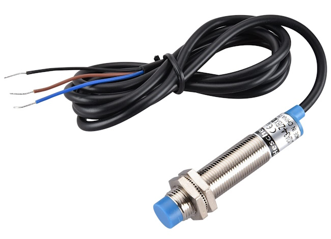
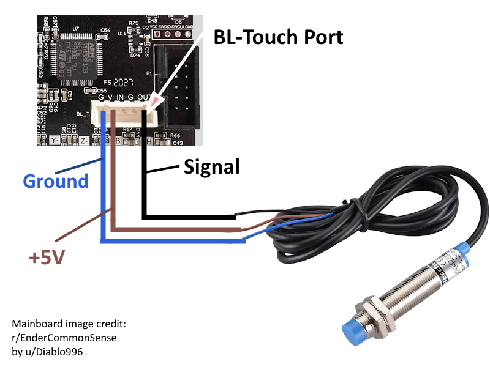
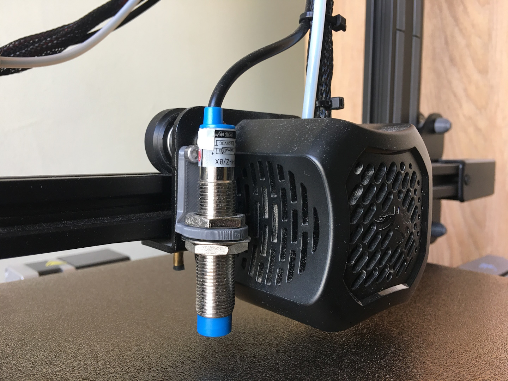

# Ender3V2-Inductive-Probe-Tutorial
This repository includes includes information on how to install a generic inductive probe on an Ender 3 V2, using [mriscoc](https://github.com/mriscoc)'s [Professional Firmware](https://github.com/mriscoc/Ender3V2S1).

> [!IMPORTANT]
> Inductive probes only work on metallic print beds, it will not work on a glass or garolite print bed, I recommend using a PEI coated spring steel print bed.

> [!NOTE]
> The Ender 3 doesn't have a very stable structure, even with dual Z-rods, and often comes misaligned out of the factory. Your mileage with any form of bed leveling will vary due to this.
> 
> I don't have a dual Z upgrade and I tried my best to level the upper frame and the gantry, despite my efforts I still can't get a perfectly accurate bed mesh especially towards the right where the gantry is unsupported.

> [!CAUTION]
> This tutorial is based on my own setup and yours might differ, try this at your own risk, **I'm not responsible for any damage to your printer.**

## Probe information
I bought a generic looking inductive probe from a local 3d printer store, with the model name "LJ12A3-4-Z/BX", it has a 12mm diameter and has 3 wires coming out of it.

The label on the probe explains the pinout like this:
```
Brown = Voltage IN
Black = Signal
Blue = Voltage OUT/Ground
```
The Signal pin is pulled high when the probe detects metal. 

Its designed to run between 6-36V but in my experience it worked fine with 5V from the BL-Touch port on the mainboard.

But your probe might be different, so make sure to check its label/documentation for the correct pinout and voltage.


## Wiring
Most probes come with bare wires, so you will need to solder headers, a 5-pin JST connector is the proper option but if you don't have the equipment, DuPont headers will also work, there is also a [3D printable model](https://www.printables.com/model/516665-jst-to-dupont-adapter-for-bltouch-easy) you can use to convert seperate DuPont headers into a JST connector. I also recommend hot-gluing the connector to the mainboard to prevent it from falling off with vibrations.

You need to connect the 3 wires to the "BL_T" port on the 4.2.2/4.2.7 mainboard, using this pinout:
```
Brown(VIN)    = V(+5V)
Blue(GND)     = G(GND)
Black(Signal) = OUT(Signal in)
```
You can consult the diagram below:


## Mounting
I used this [3D model](https://www.thingiverse.com/thing:4714593) by [Firedrops](https://www.thingiverse.com/firedrops/designs) to mount the probe to my tool head, you will need 2 M3 x 5mm screws or longer.

Align the probe vertically so that the red light comes on when the nozzle is very slightly above the print bed, and then tighten the nuts, I had to remove the washer on the top as it was interfering with the mounting screw.


## Firmware
You will have to compile the firmware yourself, I'm only going to show the required configuration changes, as the compilation process is explained better elsewhere.

Clone the [Special Configurations](https://github.com/mriscoc/Special_Configurations) repository and use the Configurator to generate an EZABLI config with UBL enabled and the options specific to your mainboard/printer setup, then modify the `Configuration.h` like this:
```cpp
#define Z_MIN_PROBE_ENDSTOP_HIT_STATE LOW // I'm not sure why, but I had to set this to low despite my probe pulling the pin high. If your tool head tries to move up while homing or fails to home, invert this.

// #define Z_MIN_PROBE_USES_Z_MIN_ENDSTOP_PIN // Comment this, as our probe is connected to the BL-Touch port

#define NOZZLE_TO_PROBE_OFFSET { -43, -1, 0 } // Change this if you are using a different mount than the one linked above
```
I included the prebuilt Manual Mesh, EZABLI, and my own inductive probe configuration in the [configurations](configurations) directory in this repo, so you can compare how they differ.

## Final setup
Set up your Z offset using any method you prefer.

Refer to the Marlin firmware UBL documentation to find the G-code commands to add to your slicer settings.
## Credits
Mainboard image cropped from [this post](https://www.reddit.com/r/EnderCommonSense/comments/1au87la/creality_422_and_427_board_connections_revised/) in [r/EnderCommonSense](https://www.reddit.com/r/EnderCommonSense/) by [u/Diablo996](https://www.reddit.com/user/Diablo996)
